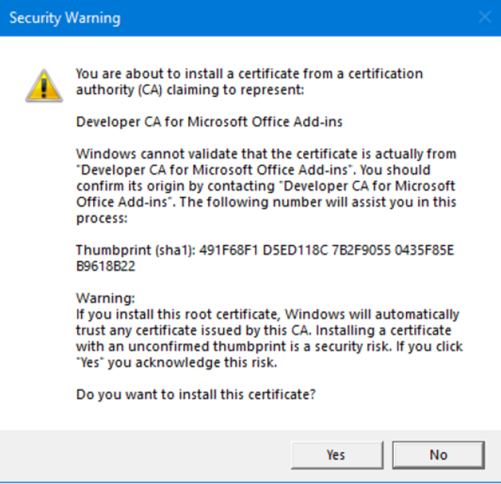

# Word Style Checking Add-in Built on Angular 2.0

> **Important Note 1**: This repo is being archived because we do not have the staff to update it or to support Angular. It can still be used for the educational purposes described below.

> **Important Note 2**: This sample has several security alerts. These vulnerabilities do not pose a problem for running and modifying this sample on your development computer, but do not use the vulnerable libraries in a production add-in. For example, it uses the latest lite-server (version 2.6.1) to host the add-in. This server package has a dependency on a version of the xmlhttprequest-ssl package that has a security vulnerability. 

Learn how to create an add-in that uses the `LocationRelation` and `compareLocationWith` APIs of the Word JavaScript APIs to perform a search and replace that skips some ranges based on their location relative to other ranges. The add-in is built on the Angular 2.0 framework, and it also shows how to use the design samples from [Office Add-in UX Design Patterns Code](https://github.com/OfficeDev/Office-Add-in-UX-Design-Patterns-Code). 

## Table of Contents
* [Change History](#change-history)
* [Prerequisites](#prerequisites)
* [Configure the project](#configure-the-project)
* [Deploy the add-in](#deploy-the-add-in)
* [Run the project](#run-the-project)
* [Start the add-in](#start-the-add-in)
* [Test the add-in](#test-the-add-in)
* [Change the settings of the add-in](#change-the-settings-of-the-add-in)
* [Understand the code](#understand-the-code)
* [Questions and comments](#questions-and-comments)
* [Additional resources](#additional-resources)

## Change History

August 1, 2016:

* Initial version.

September 15 - October 17th, 2016:

* Minor updates.

December 11th, 2020:

* Changed system for creating and installing the SSL certificates for HTTPS.

May 23rd, 2023:

* Archiving.

## Prerequisites

* Word 2016 for Windows, build 16.0.6727.1000 or later.
* [Node and npm](https://nodejs.org/en/) The project is configured to use npm as both a package manager and a task runner. It is also configured to use the Lite Server built into npm as the web server that will host the add-in during development, so you can have the add-in up and running quickly. You are welcome to use another task runner or web server.
* [Git Bash](https://git-scm.com/downloads) (Or another git client.)

## Configure the project

1. In the folder where you want to put the project open a git bash shell and take these steps:

    1. Run ```git clone {URL of this repo}``` to clone this repo to your local machine. Your project will be created in a subfolder.
    2. In the bash shell, navigate to the root of the new project.
    3. Run ```npm install``` to install all of the dependencies itemized in the package.json file.

2. Open a system Command Prompt *as an administrator* and take these steps:

    1. Navigate to the root of the project.
    2. Run the command: ```npx office-addin-dev-certs install --machine```.

       If you get the following prompt, click Yes.

       

    3. Leave the Command Prompt open.

3. In your code editor, open the `bs-config.json` file in the root of the project.
4. Replace the string "YOUR-USER-NAME-ON-COMPUTER" in both places with your username on the computer. 
5. Save and close the file.

## Deploy the add-in

Now you need to let Microsoft Word know where to find the add-in.

1. Create a network share, or [share a folder to the network](https://technet.microsoft.com/en-us/library/cc770880.aspx).
2. Place a copy of the Word-Add-in-Angular2-StyleChecker.xml manifest file, from the root of the project, into the shared folder.
3. Launch Word and open a document.
4. Choose the **File** tab, and then choose **Options**.
5. Choose **Trust Center**, and then choose the **Trust Center Settings** button.
6. Choose **Trusted Add-ins Catalogs**.
7. In the **Catalog Url** field, enter the network path to the folder share that contains Word-Add-in-Angular2-StyleChecker.xml, and then choose **Add Catalog**.
8. Select the **Show in Menu** check box, and then choose **OK**.
9. A message is displayed to inform you that your settings will be applied the next time you start Microsoft Office. Close Word.

## Run the project

In the Command Prompt, run ```npm start``` to start the web service. (The home page of the project may open in the default browser. Just close it. Add-ins can only run correctly in the context of an Office application.)


## Start the add-in

1. Restart Word and open a Word document.
2. On the **Insert** tab in Word 2016, choose **My Add-ins**.
3. Select the **SHARED FOLDER** tab.
4. Choose **Style Checker**, and then select **OK**.
5. If add-in commands are supported by your version of Word, the UI will inform you that the add-in was loaded.
6. On the Home ribbon is a new group called **Style Checker** with a button labeled **Show** and a blue pencil icon. Click that button and the add-in will open to a page of instructions.

 > Note: The add-in will load in a task pane if add-in commands are not supported by your version of Word.

## Test the add-in

1. When you are finished with the instructions, click **Get Started**.
2. When the **Find and Replace** page opens, there is a command bar at the top with a menu button. Click the button to open the menu.
3. Select **Insert sample content**. Click the button again to close the menu. The document now has unformatted text about Office Add-ins, including a fictional quotation. The writer has used an "OAI" to abbreviate "Office Add-in" and so does the anonymous quotation.
4. In the **Find** box enter "OAI". 
5. In the **Replace** box enter "Office Add-in".
6. The change should ***not*** be made in the paragraph that is a direct quotation, so enter the number **2** in the **Skip Paragraph Number** box. This is the zero-based number of the paragraph.
7. Select **Replace**. Every instance of "OAI" except the one in the skipped paragraph is changed.
8. Experiment with other search and replace strings.

 > Note: This sample add-in accepts only one number in the **Skip Paragraph Number** box and you must have some number in the box. A production add-in would allow no paragraphs to be skipped or multiple paragraphs to be skipped and would have additional ways of designating which paragraphs should be skipped; such as skipping based on paragraph style.

## Change the settings of the add-in

1. Open the menu button on the command bar again and select **Settings**. 
2. On the **Settings** page, you'll see that by default the instructions page opens every time the add-in is run. Use the radio buttons to specify that the instructions page will appear only the first time that the add-in is run. 
3. Close the task pane and then relaunch the add-in by selecting the **Show** button again. The add-in will open with the **Find and Replace** page instead of the instructions page. 
4. Navigate to the **Settings** page again. You can select the **Show Instructions** button to open the instructions page, or change the instructions setting back to open the instructions page every time the add-in is run.

## Understand the code

All of the code that uses the Office and Word JavaScript APIs is in the file word.document.service.ts. The `compareLocationWith()` method that this sample demonstrates is in the `replaceFoundStringsWithExceptions()` method. 

The code first gets a collection of all the ranges that match the user's search term. It then gets a collection of all the paragraph ranges in the document. 

```let foundItems: Word.SearchResultCollection = context.document.body.search(searchString, { matchCase: false, matchWholeWord: true }).load();```
```let paras : Word.ParagraphCollection = context.document.body.paragraphs.load();```

After the collections are loaded with a call of `context.sync()`, the code creates an array of the paragraph ranges that the user excludes from the replacement. (Note that `excludedParagraph` is a parameter passed to the method.)

```let excludedRanges: Array<Word.Range> = [];```
```excludedRanges.push(paras.items[excludedParagraph].getRange('Whole'));```

The code then loops through the iterables to determine which search results are inside excluded paragraphs and which are not. For each search result, this fact is recorded in a `IReplacementCandidate` object. The `compareLocationWith()` method returns "Inside" if the search result is inside the excluded paragraph. It returns "Equal" if the search result is a paragraph by itself and has been excluded. 

```
for (let i = 0; i < foundItems.items.length; i++) {
    for (let j = 0; j < excludedRanges.length; j++) {
        replacementCandidates.push({
            range: foundItems.items[i],
            locationRelation: foundItems.items[i].compareLocationWith(excludedRanges[j])
        });
    }
}
```
The replacement candidate objects are loaded with a call to `context.sync()` and then the code iterates through them, replacing the search string with the replace string only in the paragraphs which are not in an excluded paragraph.

```
replacementCandidates.forEach(function (item) {
    switch (item.locationRelation.value) {
        case "Inside":
        case "Equal":
            break;
        default:
            item.range.insertText(replaceString, 'Replace');
    }
});
```
See the `replaceDocumentContent` method of the same file to see how the Word `insertText` and `nsertParagraph` methods are used to insert sample content into the document.

See the rest of the code files to see how the design patterns from [Office Add-in UX Design Patterns Code](https://github.com/OfficeDev/Office-Add-in-UX-Design-Patterns-Code) have been integrated into the Angular 2.0 framework.

## Questions and comments

We'd love to get your feedback about this sample. You can send your feedback to us in the *Issues* section of this repository.

Questions about Microsoft Office 365 development in general should be posted to [Stack Overflow](http://stackoverflow.com/questions/tagged/office-js+API). If your question is about the Office JavaScript APIs, make sure that your questions are tagged with [office-js] and [API].

## Additional resources

* [Office add-in documentation](https://msdn.microsoft.com/en-us/library/office/jj220060.aspx)
* [Office Dev Center](http://dev.office.com/)
* More Office Add-in samples at [OfficeDev on Github](https://github.com/officedev)

## Copyright
Copyright (c) 2016 and 2020 Microsoft Corporation. All rights reserved.


This project has adopted the [Microsoft Open Source Code of Conduct](https://opensource.microsoft.com/codeofconduct/). For more information, see the [Code of Conduct FAQ](https://opensource.microsoft.com/codeofconduct/faq/) or contact [opencode@microsoft.com](mailto:opencode@microsoft.com) with any additional questions or comments.
